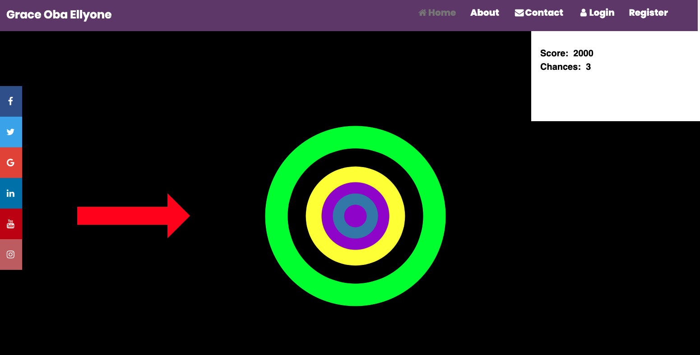

# Milestone Project 2

---

## Gness Memory Game

This project is a summary of study from the fourth and fifth module of the Full Stack Developer Course - JavaScript Fundamentals & Interactive Frontend Development, to build a custom, mobile-first, fully responsive Vanilla JavaScript memory game.

The purpose of the game is to improve memory skills. Players can race against the countdown timer and keep track of their scores to see how well their memory skills are improving. The game is short and mobile-friendly so it's ideal for pl!

[Game Plan](assets/Plan.png)
## Table of contents

- <a href="#about">ABOUT</a>
- <a href="#purpose">PURPOSE</a>
- <a href="#stages">STAGES OF DEVELOPMENT</a>
  - <a href="#initialstage">	INITIAL STAGE 
</a>
    - <a href="#rpjustification">Research / Project justification
</a>
  - <a href="#planningdesign">PLANNING THE DESIGN
</a>
    - <a href="#uxdesign">UX design
</a>
    - <a href="#userstory">User Story
</a>
    - <a href="#design">Design
</a>
  - <a>EXECUTION</a>
    - <a href="technology">Technology used – Language</a>
    - <a href="framework">	Framework, Library & Programs
</a>
  - <a>Testing</a>
    - <a> Manual Testing </a> 
    - <a> User stories </a>
    - <a> Bugs </a>
- <a href="#deployment">Deployment 🚀</a>
- <a href="#features">Features List 😲</a>
  - <a href="#existing">Existing Features</a>
  - <a href="#future">Future Features</a>
- <a href="#credits">Credits 🙏</a>
  - <a href="#code">Code</a>
  - <a href="#media">Media</a>
  - <a href="#ack">Acknowledgments</a>

## 1️⃣ ABOUT 

This project is a summary of knowledge gained during course module on JavaScript Fundamental and Interactive Front-End Development, to build a simple single memory game and to comply to all four phases of software development which are 
 
<ul>
  <li>1.Initial phase</li>
  <li>2. Planning phase</li>
  <li>3. Execution phase</li>
  <li>4. Deployment phase</li>
</ul>

In this this documentation,   I will provide 
a. Reader with full justification and inspiration behind my choice of this special and unique game
b. User with full explanation on how to benefit from the game 
c. User with scoring counter to allow the participant to build up points of progression.

<a href="#top">Back to top ⬆️</a>

## 2️⃣ PURPOSE

The purpose of this game is to provide an inclusive educational memory game for users 
i. with Hearing-loss
ii. without Hearing-loss
in improving their literacy, communication and cognitive skills in an interactive environment.

## 3️⃣ STAGES OF DEVELOPMENT

AS A USER
1. As a user, I want to interact with the game that will allow me to learn amd memorise English words with British Sign Language [BSL] to improve my literacy, communication and cognitive skills. 
- The main purpose of the game is to :
a. improve communication skill of children and young adult who have hearing-loss 
b. influence in reducing the impact of mental health among this minority due to social magilisation.  The user can click the mouse to initialise the arrow to the centre of the dart board which consist of random BSL video and English words.
2. As a user, I want to know how playing memory games can improve cognitive, communication and literacy skills.
- Information about the benefits of playing memory games can be found in the PURPOSE.
3. As a user, I want a laptop/PC game to play whilst in quite environment without distraction and I will be able to practice my communication skill.

4. As a user, I want a game that is intuitive and easy to use so that I can learn how to use it quickly.
- The game is very intuitive to use. In addition player can find how to play info in purpose.
5. As a player, I want to see my score so that I can see if I am making progress.
- Users can keep track of their score by watching the timer, turn count and points while they're playing the game, and see their best scores in best score section in the game. Also if they misses the targer in centre they will be able to see how many chances they have not be a losser but a winner too.
6. As a player, I want a fun game that will attract both hearin and hearing-loss children and young adult to play and help with their cognitive, communication and literacy skills.

#### Developer:

1. As a developer, I want to develop a memory game software  using JavaScript.
- JavaScript is the main language that was used to create the game.
2. As a developer, I want to create fully responsive app to showcase my skills to a potential employer.
- Application is fully responsive thanks to  P5Js framework and mobile first design ap.
3. As a developer, I wanted to create a game that will be inclusive and meet the need of people that are living in isolation as a result of their disability. It had been a dream working in special school and to find resource of interest to meet individual need compare to children and young people of the same age with no disability

### Design:

#### Colour Scheme:

3 primary colours are used which are the main  colours:
- #663F74 
- #000000
- #ffffff

All colours were used to style various elements in application.

#### Content Structure:

The main game geometry of the game is square, it refers in this way to Lego bricks. The game base on two sections and modals. All modals are square and have blue backgrounds. It is very easy solution to make sure all will be good visible on mobile devices.

#### Images:

The main image in main menu section is Emmet which is well know character from Lego movie. It will focus attention around younger and also older players.

#### Wireframes:

- <a href="memory game wireframe.pdf" target="_blank">Memory Game wireframe</a>

<a href="#top">Back to top ⬆️</a>

## 3️⃣ Technologies Used 🔨

### Languages Used:

- <a href="https://en.wikipedia.org/wiki/HTML" rel="noopener" target="_blank">HTML</a> - Standard mark-up language for documents designed to be displayed in a web browser.
- <a href="https://en.wikipedia.org/wiki/CSS" rel="noopener" target="_blank">CSS</a> - Describes how HTML elements are to be displayed on screen, paper, or in other media.
- <a href="https://en.wikipedia.org/wiki/JavaScript" rel="noopener" target="_blank">JavaScript</a> - Is a programming language that conforms to the ECMAScript specification.

### Frameworks, Libraries & Programs Used:

- <a href="https://p5js.org/" rel="noopener" target="_blank">P5JS</a> - Javascript framework used to create games OOp language.
- <a href="https://git-scm.com/" rel="noopener" target="_blank">Git</a> - Free and open source distributed version control system.
- <a href="https://github.com/" rel="noopener" target="_blank">GitHub</a> - A Git repository hosting service.
- <a href="https://fontawesome.com/" rel="noopener" target="_blank">Font Awesome</a> - A web font containing all the icons from the Twitter Bootstrap framework, and now many more.

- <a href="https://wireframepro.mockflow.com" rel="noopener" target="_blank"> wireframepro </a> - Wireframing tool.

<a href="#top">Back to top ⬆️</a>

## 4️⃣ Features List 😲

### Existing features:

#### Main Menu:

This is the first screen presented to the player. There are four main buttons:
- Play - After pressing this button, difficulty level modal pop up. After choosing level the game will start.
  	- Cancel button will dismiss modal.

  
- About - After pressing this button, about modal pop up. Player can check game rules, scoring system and benefits of playing memory games.
  - Close button will dismiss modal.

 

- Highscores - After pressing this button, highscores modal pop up. Player can check scores for each difficulty level, they are sorted by points from high to low. Scores are stored in local storage and best 5 scores for level will be presented. Hover effect will highlight selected row.
  - Clear scores button will trigger confirmation modal.
  
  "Yes" will clear local storage and delete rows with scores for each level when "No" will close confirmation modal.
  
  - Close button will dismiss modal.

  

- Arrow - After clicking the mouse the arrow start appears coming from left directionn with main target is the centre of the dart board. User can check who developed game and find contact information. There is also an evalution section and details of the devloper with special thanks to my mento.
  - Close button will dismiss modal.

#### Game Arena:

Cards are displayed in the middle of the game arena. The number of cards depends on level (easy: 8, medium: 12, hard: 16). When player clicks on a card, the card turns and the picture side of the card is presented. When two cards match they will stay on the screen, if don't they will reverse back. The main features are:

- Points - They are increase every time player match 2 cards and decrease when doesn't match.

- Level - There are three levels: easy, medium, hard. Display depends on level.

- Time - There is 60 sec to complete the level. Timer counts down when the game starts.

- Turn counter - Increases by 1 every time player reveal 2 cards.

- Quit - After pressing this button player will be redirected to main menu. From the he can start new game again.

- Volume icon - Pressing this icon will toggle on/off audio in the application.

#### End of the game:

Lose:
- Times up - Times up modal will pop up when timer reach 0. Adequate audio will play. Player will have option to play level again or quit.
  - Yes button will reset level again.
  - No button will redirect to main menu.

  

Win:
- Game win - Game win modal will pop up when player match all pairs before times up. Adequate audio will play. This modal contain total score for played game. In input field player can put his name.
  - Save button will save score and optionally name in local storage. If score is within best 5 scores it will be displayed in level highscores modal.
  - Close button will redirect to main menu without saving.

- Level highscores - This modal will pop up when player click save button in game win modal. It shows best scores only for current level. Hover effect will highlight selected row.
  - Clear scores button will clear local storage and delete rows with scores only for current level.
  - Close button will redirect to main menu.

 
  

### Future features:

- Live Play - I'd like to add functionality to allow users to interact and compete with friends or other players with features like a real-time scoreboard and the option to send invites and challenges to other players.
- Variation of Themes - The current theme of the site is geared more towards children than adults, so I'd like create multiple themes so that users can select a theme when they first arrive on the site and their preference would be saved for the next time they visit.

<a href="#top">Back to top ⬆️</a>

## 5️⃣ Testing 🔥

### Manual Testing:

Only manual testing method was used to test this project due to big gap of knowledge on how to use automatic testing tools like Jasmine or Enzyme yet. All functions were tested by myself by creating different scenarios.

Testing and improving the application was carried out throughout its development. The main testing tool was Google Chrome dev tools and devices such as a phone, tablet and laptop with several versions of browsers (Google Chrome, Firefox, Edge, Opera).

Passing the HTML file content through the W3C Validator for HTML resulted in no errors but one warning "Section lacks heading" which was game arena section but this is intentional so I ignored. The Bootstrap framework was tested extensively to ensure that the Mobile first Responsive Approach was achieved with this project. The Application was tested on my Lenovo Thinkbook laptop and large Samsung TV screen, Samsung Galaxy S6 mobile and Lenovo tablet. The application worked fine on all devices. If something didn't work as it should during the test it was immediately checked and corrected in DevTools and then implemented into the code and checked again. If test passed it was committed and pushed into repository. 

I used JSHint to validate JavaScript file configured to accept jQuery & ES6 features like const and let variables. There was no major warnings but this test allowed me to see where I had missing semi-colons from block of code and detect unused variables.

The project contains as much vanilla JavaScript as possible to allow the developer to understand the language appropriately. jQuery was used in total of four times to target the modal elements to show/hide.

CSS file content was regularly checked in the W3C Validator for CSS to ensure any errors were spotted throughout the development of the style sheet. As with the HTML validation if any errors were present they were checked in DevTools and then copy and pasted over to the code before committing and pushing the updated code to my GitHub Repository.

 ### User Stories:

 Here are the steps and results from the testing carried based on the project user stories to determine that the game and functionality are fit for purpose
 
 Result: Game works as expected. There is a problem with "match" audio when two pairs reversed in short amount of time, there is no audio confirmation for second pair. This is more obvious on mobile where it is easier to tap many cards quickly.

Result: Game works as it should. All scores are grouped in correct level tables.

Bugs:
- Site works on only desktop devices .

<a href="#top">Back to top ⬆️</a>

## 6️⃣ Deployment 🚀

This project was developed in Visual Studio Code editor. All developments were pushed to the corresponding repository in GitHub account.

In order to deploy the website to GitHub pages, I:

- Selected the Repository from the GitHub Dashboard.

- Navigated to "Settings" then "GitHub Pages".

- Selected "master branch" in Source section.

- Page auto refreshed and link generated under GitHub Pages section:

  👉 Your site is published at https://zokam1411.github.io/milestone-project-2/

### Run this project locally:

- Select the Repository from the GitHub Dashboard.

- Click the green button labelled 'Code'.

- Click 'Download ZIP'.

- Extract ZIP file on your computer.

- Open folder and open index.html in web browser.

### Clone this project:

- Select the Repository from the GitHub Dashboard.

- Click the green button labelled 'Code'.

- To clone the repository using:
    - HTTPS: under "Clone with HTTPS", click checklist icon.
    - SSH: click Use SSH, then click checklist icon.

- Open Git Bash.

- Change the current working directory to the location where you want the cloned directory.

- Type 'git clone', and then paste the URL you copied earlier.

- Press Enter to create your local clone.

<a href="#top">Back to top ⬆️</a>

## 7️⃣ Credits 🙏

### Code:

- <a href="https://p5js.org/">P5js</a> library mainly to make site interactive 

- <a href="https://www.w3schools.com/">W3 Sschools</a> referenced for code:
  - The Fisher Yates Method to sort an array.
  - How to use local storage.

### Media:

- Emmet image in main menu: <a href="https://favpng.com/">favpng</a> (Licence free)
- Cards figures images: <a href="https://www.cleanpng.com/">cleanPNG</a> (Licence free)
- Icons: <a href="https://fontawesome.com/">Font Awesome</a>
- Audio: <a href="https://www.zapsplat.com/">Zapslat</a> (licence free)

### Acknowledgments:

- <a href="https://codeinstitute.net" rel="noopener" target="_blank">Code Institute</a>
- <a href="https://stackoverflow.com/" rel="noopener" target="_blank">Stack Overflow</a>
- Code Institute Slack Community.
- My mentor Guido Cecilio for guidance and support.
- My family and friends for their patience and honest critique throughout.

<a href="#top">Back to top ⬆️</a>

